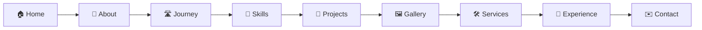

<div align="center">


<br>


**A responsive, animated personal portfolio with 3D effects.**

[🚀 Quick start](#-run-locally) · [🖼️ Add images](#️-add-your-images) · [🎨 Customize](#-customize) · [🌐 Deploy](#-deploy-free)

</div>

---

## 🧭 Page flow



## ✨ Features

| 🎬 Animations | 🧊 3D effects | 🖼️ Images | 🎨 Theme |
|---|---|---|---|
| Typing effect | Tilt photo frame | Profile photo slot | 7 accent colors |
| Animated counters | Tilting cards | Project screenshots | Dark / light mode |
| Skill bars | Floating info boxes | 6-slot gallery | Remembers your choice |
| Scroll reveal and progress bar | Light-shine on hover | Safe placeholders | Cursor glow |

## 📁 Folder structure

```
shailesh-portfolio/
├── index.html              # Page structure and sections
├── css/
│   └── style.css           # Custom styles, 3D and animations
├── js/
│   ├── tailwind-config.js  # Theme colors, accent color, dark mode default
│   └── script.js           # Content data and all interactions
└── images/
    └── shailesh chauhan .pdf   # Resume (used by the Resume button)
```

## 🚀 Run locally

1. Unzip the project.
2. Double-click `index.html`.

An internet connection is needed because Tailwind CSS and Google Fonts load from a CDN.

## 🖼️ Add your images

Put images in the `images/` folder with these exact names. Any image that is missing shows a colored placeholder, so nothing breaks.

| Image | File name |
|---|---|
| Profile photo (hero) | `images/profile.jpg` |
| Project screenshots | `images/project-1.jpg` to `images/project-4.jpg` |
| Gallery (6 slots) | `images/gallery-1.jpg` to `images/gallery-6.jpg` |

Tip: a photo with a dark or plain background looks best in the hero frame. The "Preview your photo" button under the hero lets you test an image instantly without saving it.

## 🎨 Customize

**Text, projects and journey**
- Hero text, About, Services, Experience and Contact: edit `index.html`.
- Projects (title, description, tech, links) and Journey steps: edit the `projects` and `journey` lists in `js/script.js`.
- Skill bar percentages: edit the skills list near the bottom of `js/script.js`.

**Colors**
- Click the dots at the bottom-right of the site to try an accent color.
- To set a permanent default, change `190` in `js/tailwind-config.js` (this is the color hue).

| Orange | Gold | Green | Cyan | Blue | Violet | Pink |
|---|---|---|---|---|---|---|
| 25 | 45 | 150 | 190 | 220 | 265 | 330 |

**Links**
- Replace the placeholder LinkedIn, GitHub, email and project Live Demo / GitHub URLs with your own.

## 🌐 Deploy (free)

- **GitHub Pages:** push the folder to a repo, then Settings, Pages, deploy from the `main` branch.
- **Netlify:** drag and drop the folder at app.netlify.com/drop.
- **Vercel:** import the repo and deploy. No settings are needed.

## 🧱 Tech stack

HTML5, Tailwind CSS (CDN), JavaScript (ES6), Google Fonts (Inter and Space Grotesk).

## 📬 Contact

**Shailesh Chauhan**, Frontend / Web Developer, Lucknow, Uttar Pradesh, India
